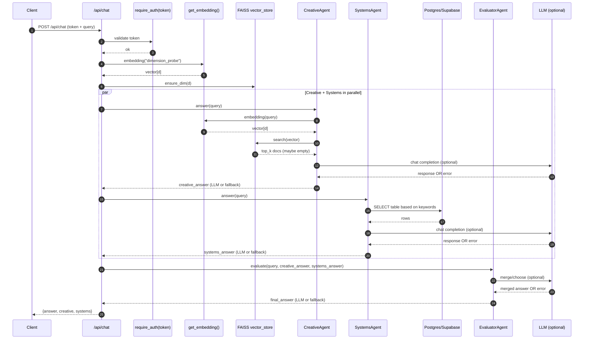

# /api/chat endpoint architecture

> This is an “architecture image” using Mermaid (renders in VS Code + GitHub).

## High-level flow (components)

```mermaid
flowchart TD
  Client[Client / Postman] -->|POST /api/login/webcam (image)| AuthAPI[Auth API]
  AuthAPI --> Face[Face detection (OpenCV)]
  Face -->|token| Client

  Client -->|POST /api/chat\nHeader: token\nBody: {query}| ChatAPI[/Chat API: /api/chat/]

  ChatAPI -->|Depends(require_auth)| AuthGate[Auth gate\n(in-memory token set)]

  ChatAPI -->|probe embedding dim| Embed[get_embedding("dimension_probe")\nSentenceTransformers (local)\nor remote embeddings]
  ChatAPI -->|ensure_dim(d)| VS[FAISS Vector Store\n(load + dim sync)]

  ChatAPI --> Parallel{{Run in parallel}}

  Parallel --> Creative[CreativeGameDesignAgent]
  Creative -->|get_embedding(query)| Embed
  Creative -->|vector search| VS
  Creative -->|LLM call (optional)| LLM[(OpenAI-compatible LLM)]
  Creative -->|fallback if LLM fails| Creative

  Parallel --> Systems[SystemsAgent]
  Systems -->|SQL queries by keyword| DB[(Postgres/Supabase)]
  Systems -->|LLM call (optional)| LLM
  Systems -->|fallback if LLM fails| Systems

  Creative --> Eval[EvaluatorAgent]
  Systems --> Eval
  Eval -->|LLM merge (optional)| LLM
  Eval -->|fallback merge if LLM fails| Eval

  Eval -->|JSON: answer, creative, systems| Client
```

## Runtime sequence (what happens per request)



## Notes (why you sometimes see “LLM fallback”)

- If the LLM call fails (missing key, quota/429, provider down), each agent returns a deterministic fallback string.
- In your current handler, if the Creative agent throws an exception before its internal fallback, `/api/chat` sets `creative` to an empty string.
