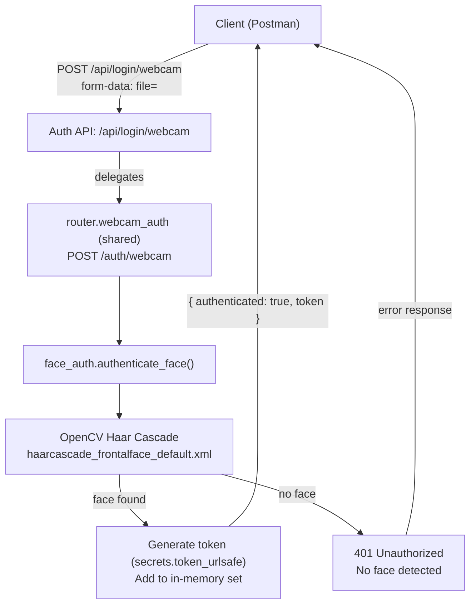
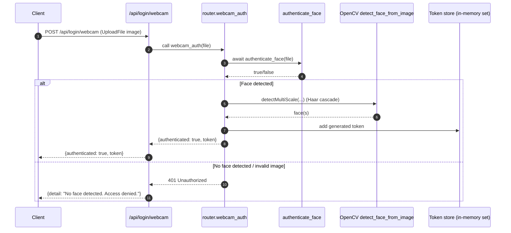

# /api/login/webcam endpoint architecture

> This is an “architecture image” using Mermaid (renders in VS Code + GitHub).

## High-level flow (components)

## Runtime sequence (per request)

## Notes / constraints

- The token is stored only in server memory (`authenticated_users` set). If the server restarts, previously issued tokens stop working.
- This endpoint only checks whether *a face exists in the image* (not identity matching). It’s “presence detection”, not true face recognition.
- The token must be sent on later requests as an HTTP header named `token` (example: `token: <value>`).
